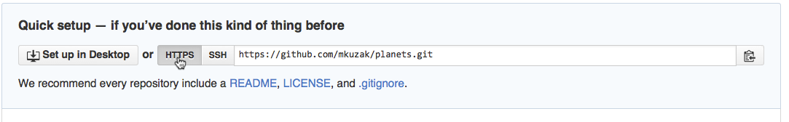

# Automated version control
<!-- 5 min -->

{width=50%}

---

Have you ever used "undo"? and "redo"?

---

A **version control system** is the same, but better:

- nothing recorded is ever lost (commits)
- multiple parallel versions (branches)
- what/when/who/why is recorded (metadata)
- works offline and online (GIT vs. Github)
- identify and correct conflicts (merge)

---

{width=100%}

---

{width=60%}

---

{width=60%}

---

# Mission to Mars


---

# Setting up Git
<!-- 5 min -->


- install GIT
- `git config --global`

---

- open a terminal

- set user name and email, line endings, default editor

```bash
git config --global user.name  "Vlad DRACULA"
git config --global user.email "vlad@tran.sylvan.ia"

git config --global core.autocrlf input  # MacOS/Linux
git config --global core.autocrlf true  # Windows

git config --global core.editor "nano -w"
```

- check configuration
```bash
git config --list
```

- explore options
```bash
git config -h
git config --help
```

<!-- note: `:q` to exit VIM -->


#  Creating a repository
<!-- 10 min -->

- `git init`
- `git status`

---

- create a new directory
```bash
cd ~/Desktop
mkdir planets
cd planets
```

- intialize the GIT repository
```bash
git init
ls 
ls -a  # note .git folder
git status
```

<!-- note: try removing .git -->


# Tracking changes
<!-- 20 min -->

- modify-add-commit cycle
- `git add`
- `git commit -m`
- `git status`
- `git log`
- `git diff`

---

- add a text file
```bash
cd ~/Desktop/planets
nano mars.txt
ls
cat mars.txt
```

- **commit** this new text file
```bash
git status
git add mars.txt
git status
git commit -m "start notes on Mars as a base"
git status
git log
```

---


---

- change the text file and commit the changes
```bash
nano mars.txt
git status
git diff
git add mars.txt
git diff
git diff --staged
git commit -m "add concerns about Mars for Wolfman"
```

- list changes (1 line per commit)
```bash
git log --oneline
```

<!-- note: exit `git log` with `Q`, navigate pager -->

---

# Challenge

- make a one-line change to `mars.txt`
- create `earth.txt` with a one-line comment
- commit both changes as a *single* commit

{width=70%}

- when done, add **mooooore** commits (create and modify files)

<!-- note: only files are tracked, not directory -->

---

# Exploring history
<!-- 25 min -->

- `HEAD` and commit ID
- `git diff`
- `git show`
- `git checkout`

---

- make some changes to `mars.txt`
```bash
nano mars.txt
cat mars.txt
```

- check changes from previous, previous-previous, previous-pevious-previous
```bash
git diff HEAD mars.txt
git diff HEAD~1 mars.txt
git diff HEAD~2 mars.txt
```

- **show** a specific version
```bash
git show HEAD~1:mars.txt  # /!\ colon sign
```

- use commit ID directly
```bash
git log
git diff e585843 mars.txt
git show e585843:mars.txt
```

---

- remove any (not commited) changes
```bash
git status
git checkout HEAD -- mars.txt
git status
```

- bring back an older version
```bash
git checkout HEAD~1 -- mars.txt  # or use a commit ID
git status
cat mars.txt
git diff
git diff --staged
```

---

- travel back in time (detached `HEAD`)
```bash
git checkout HEAD~2
git status
ls
cat mars.txt
```

- and back to current version
```bash
git checkout master
ls
cat mars.txt
```

---


---

# Quiz time

Jennifer has made changes to the Python script that she has been working on for
weeks, and the modifications she made this morning "broke" the script and it no
longer runs. She has spent ~ 1hr trying to fix it, with no luck…

Luckily, she has been keeping track of her project’s versions using GIT! Which
commands below will let her recover the last committed version of her Python
script called `data_cruncher.py`?

1. `git checkout HEAD`
2. `git checkout HEAD -- data_cruncher.py`
3. `git checkout HEAD~1 -- data_cruncher.py`
4. `git checkout <last commit ID> -- data_cruncher.py`
5. Both 2 and 4

<!-- note: show gitk -->

---

# Ignoring things
<!-- 5 min -->

- `.gitignore` file

---

- create a junk file and a spurious folder
```bash
nano pluto.txt~
mkdir tmp
nano tmp/more_junk_file.txt
git status
```

- create a `.gitignore` file
```bash
nano .gitignore
git add .gitignore
git commit -m "Ignore junk files"
git status
```

---

# Remotes in Github
<!-- 30 min -->

- create a GIT repository on Github
- `git remote`
- `git push`
- `git pull`

---

- go to https://www.github.com
- create an account (or log in)
- set email **private** if needed

- create an empty `planets` repository
  - Public
  - `README` set to `None`
  - `LICENSE` set to `None`

---

{width=80%}

---

- **web browser:** copy remote address from the Github page


- **terminal:** set a remote location and check
```bash
git remote add origin https://github.com/vlad/planets.git
git remote -v
```

- **terminal:** send local changes to Github, **push**ing them
```bash
git push -u origin master  # only the first time
git push  # anytime after
```

- **web browser:** check changes in the repository page

- **terminal:** retrieve changes locally, if any...
```bash
git pull
```

---

# Collaborating and conflicts
<!-- 25 + 15 min -->

- `git clone`
- `git merge`

---

- **clone** my repository
```bash
cd ~/Desktop
git clone https://github.com/jennan/planets planets_maxime
cd planets_maxime
ls
cat mars.txt
```

- add your own changes (while I am doing it too)
```bash
nano mars.txt
git add mars.txt
git commit -m "rectify approximate statements"
git log --oneline
```

---


---

- retrieve my latest changes
```bash
git pull
git status
cat mars.txt
```

- fix the conflict and bring back peace in the repository
```bash
nano mars.txt
git add mars.txt
git commit -m "fixed divergent opinions, kept best"
```

- emergency command to cancel (then redo from pull)
```bash
git merge --abort
```

- (if time allows) invite your neighbor as collaborator on Github, create conflicting commits and test push/pull

<!-- note: show mergetool -->

---

# Fork existing project

- **web browser:** fork Joaquin's code
  https://github.com/joacorapela/pystarters2019

- **terminal:** clone your copy of his code
```bash
cd ~/Desktop
git clone https://github.com/YOUR_LOGIN/pystarters2019
```

---

# Bonus

- `git branch`
- `git stash`
- `git tag`
- `git blame`
- `git reset`
- `git revert`
- `git rebase`

- pull requests
- ticketing system
- feature branch workflow

<!-- note: show a big project repository -->
